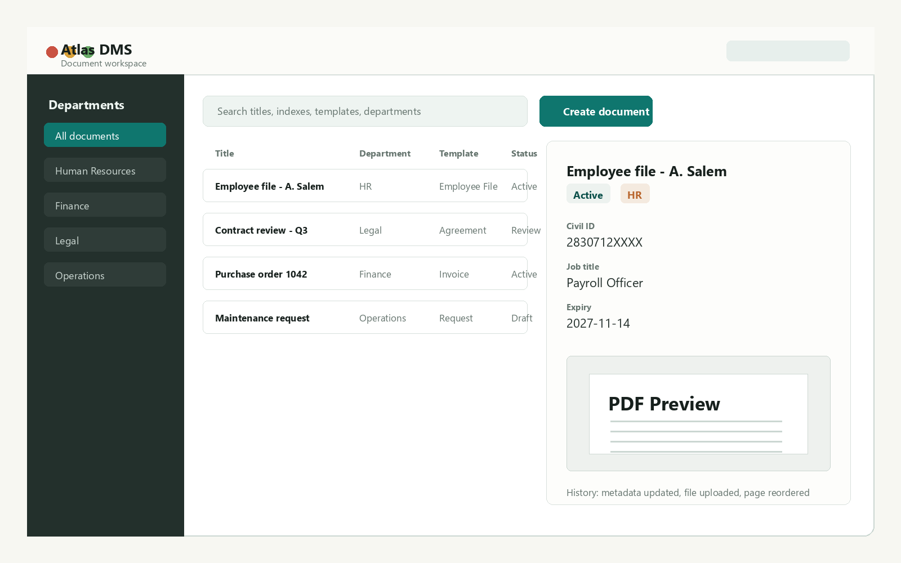
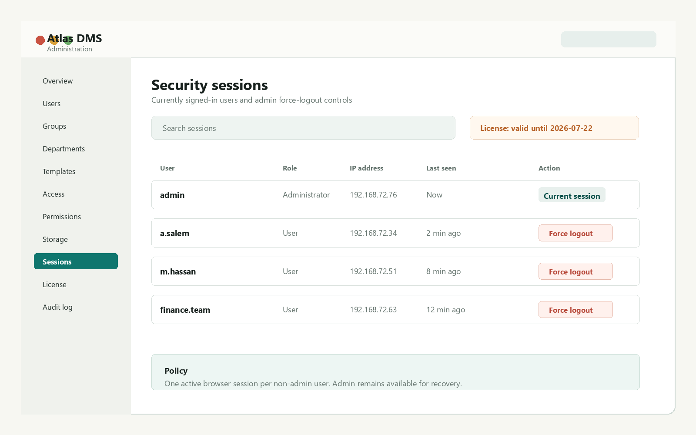
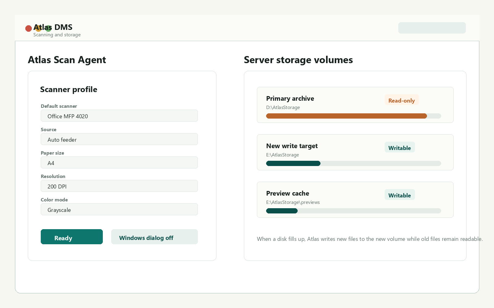

# Atlas DMS

Private on-prem document management for structured records, controlled access,
scanning, audit history, and local data ownership.

> This public repository is a product overview only. The Atlas application
> source code, release packages, private license tools, signing keys, customer
> data, deployment secrets, and runtime files are not included.

[View the public site](https://ahmadness.github.io/atlas-dms/)

## Product Screenshots

The screenshots below use synthetic sample data and do not show customer
documents or private deployment details.

| Admin security and sessions | Scanning and storage |
| --- | --- |
|  |  |

## What Atlas Is

Atlas DMS is built for organizations that need documents to stay on their own
server while still having structured metadata, role-based access, scanning,
search, document history, storage growth, and administrator controls.

It is designed for controlled on-prem trials and private customer deployments,
not public SaaS file sharing.

## Core Capabilities

### Document Records

- Create structured document records from configurable templates.
- Define typed indexes such as text, number, date, dropdown, user, and
  department fields.
- Mark indexes as required or searchable.
- Generate document titles from template fields.
- Keep template edits version-safe so older records remain readable.
- Support all-department templates and department-specific templates.
- Filter valid templates by selected department during document creation.

### Files, Pages, and Preview

- Upload PDF and image files into document file categories.
- Preview PDF/image content in the browser.
- Keep immutable file versions when replacing files.
- Merge multiple PDF files inside a document.
- Split PDF files into separate active files when allowed.
- Insert scanned or uploaded pages into an existing file.
- Reorder and delete generated pages.
- Preserve file, page, and metadata history.

### Search and Reporting

- Search by title, department, template, status, file state, and index values.
- Use advanced search conditions across document metadata and template fields.
- Save reusable filters.
- Export document data to Excel/ZIP where enabled.
- Review administrative reports for users, departments, required-file gaps,
  lifecycle events, and operational totals.

### Access Control

- Manage users, groups, departments, templates, folders, and document-level
  access.
- Support view, create, edit, delete, manage, scan, print, download, export,
  and report permissions.
- Assign department and template access directly to users or through groups.
- Allow different users in the same department to have different abilities.
- Apply document visibility rules by template field values.
- Keep administrators available for recovery and controlled support work.

### Admin Console

- Users, groups, departments, templates, permissions, and access management.
- Active session list with force logout controls.
- Audit log for important document/admin actions.
- License status and signed license installation.
- Storage volume management for adding new disks.
- Reports for operational review.
- English and Arabic interface support.

### Scanning

- Browser scan actions work through a local Windows Atlas Scan Agent.
- Users scan from their own PC while files upload to the Atlas server.
- Default scanner selection is remembered per workstation.
- Scanner profile includes source, paper size, DPI, and color mode.
- Feeder scans can create one multi-page PDF.
- Right-click page insertion can insert multiple feeder pages into an existing
  file in order.
- Native Windows scanner dialogs can be enabled when needed.

### Storage Growth

- Store objects on filesystem or S3-compatible storage.
- Track which storage volume owns each stored object.
- Add a new disk as the default write target when an old disk fills up.
- Keep old volumes readable while stopping new writes to them.
- Continue adding files to old documents while new blobs land on the new
  writable volume.

### Licensing and Trial Control

- Offline signed license verification.
- Machine-locked licenses tied to a server fingerprint.
- Expiry date for controlled trials.
- Active non-admin user limits.
- Admin renewal path through Admin > License.
- Private vendor signing keys and license issuing tools stay outside customer
  packages.

## Typical Trial Deployment

1. Install Atlas on a Windows server on the customer's network.
2. Configure PostgreSQL and object storage.
3. Generate production secrets and runtime configuration.
4. Create the first administrator.
5. Capture the server fingerprint.
6. Issue a signed 30-day machine-locked license.
7. Install the license through Admin > License or `license.json`.
8. Install the scan agent on workstations that need scanner access.
9. Users open Atlas through the server IP or internal URL.
10. Future updates preserve the database, storage folders, `.env`, and
    `license.json`.

## Security and Source Model

Atlas is proprietary software. Public materials are intentionally separated
from the private codebase.

The public repository does not include:

- backend or frontend source code;
- build scripts for the private application;
- release ZIPs or protected binaries;
- private license generator tools;
- signing keys;
- `.env` or customer license files;
- uploaded documents, backups, logs, or runtime data;
- screenshots from real customer environments.

## Availability

Atlas DMS is available only through private demo, trial, or deployment
discussion with the Atlas vendor.

For demos, trials, or deployment planning, contact the Atlas vendor directly.

